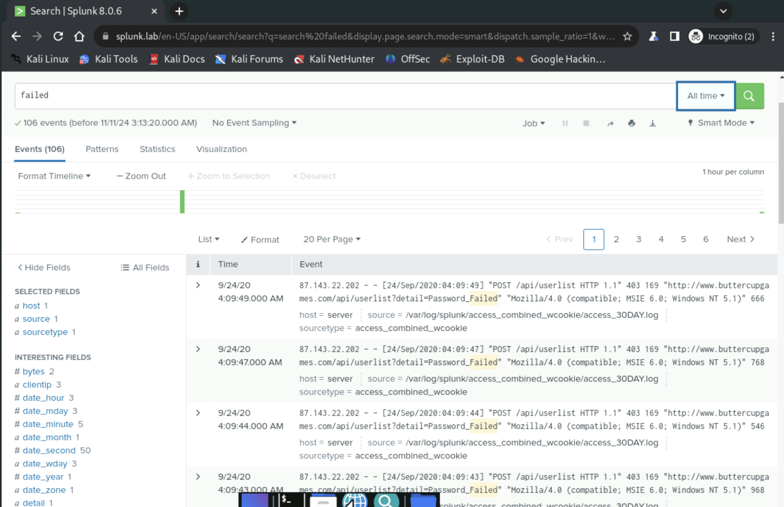
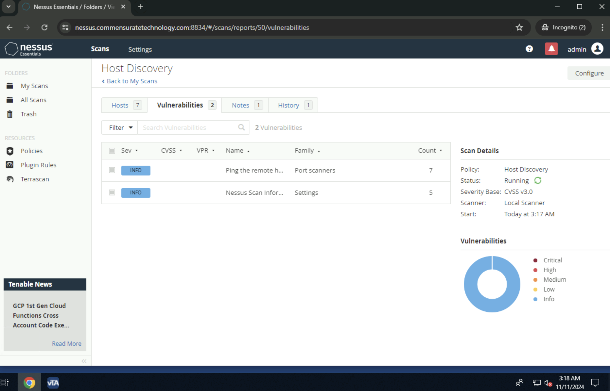
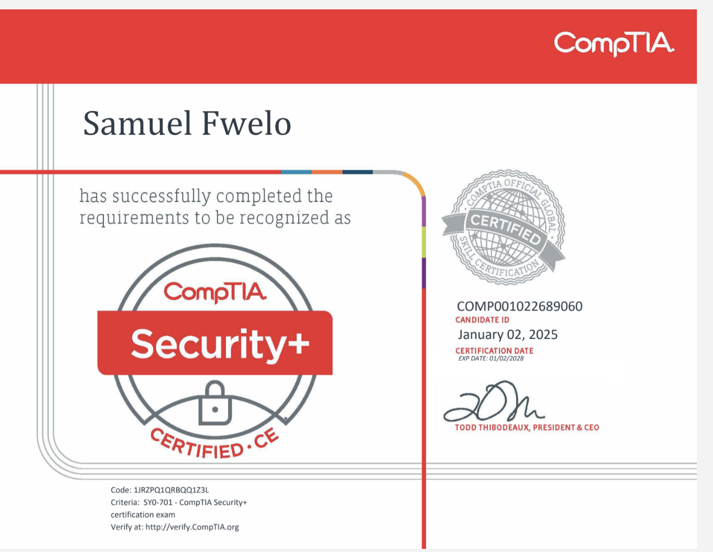
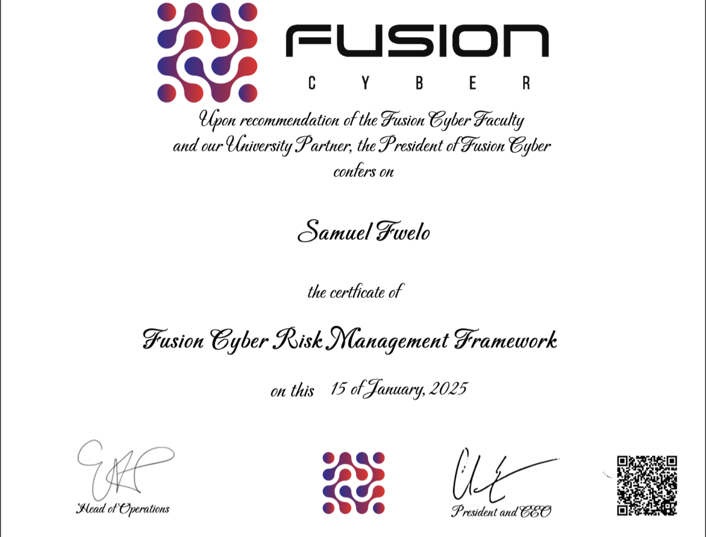

# Welcome to My Cybersecurity Portfolio!

I am **Samuel Fwelo**, a cybersecurity professional with a background in Information Communication Technology from the University of Kentucky. Through hands-on experience at Fusion Cyber, I’ve developed skills in **threat detection**, **vulnerability scanning**, **SIEM tools**, and **cloud security**. Explore my work and skills here!

---

## About Me

I graduated with a **Bachelor’s degree in Information Communication Technology** and a **minor in Communication** from the University of Kentucky in December 2024.
My passion for cybersecurity stems from a deep curiosity about how technology shapes our world and a commitment to protecting digital ecosystems. From an early fascination with computing, I’ve evolved into someone who finds immense satisfaction in uncovering vulnerabilities and fortifying systems. With each new tool, framework, or challenge, I’m driven by the thrill of learning something new and the responsibility of keeping vital data safe.

I’m continuously learning new tools and frameworks to keep pace with the evolving cybersecurity landscape. Below, you’ll find an overview of my practical experience, toolset, and future ambitions.

---

## Cybersecurity Experience
During my internship at **Fusion Cyber**, I utilized **Splunk** to monitor and analyze security events in real time. This screenshot highlights:

- **Search Query**: Filtering logs with the keyword *“failed”* to identify potential password failures.  
- **Event Timeline**: Displays timestamps and sources for suspicious login attempts.  
- **Detailed Log Analysis**: Provides insight into user behavior and system error codes.

**Key Contributions:**  
- Created **custom dashboards** to track critical threat indicators.  
- Optimized queries for faster detection of repeated login failures.  
- Collaborated with the incident response team to escalate high-severity alerts.

---

### Microsoft Sentinel (Cloud Security)
I leveraged **Microsoft Sentinel** on Azure to configure security rules, monitor threats, and manage incidents in a cloud environment. This screenshot shows: 

- **Active Rules**: Configured analytics rules, ranging from High to Medium severity.  
- **Real-Time Analytics**: Immediate visibility into suspicious inbox rules, sign-in anomalies, and potential lateral movement.  
- **Cloud Incident Response**: Centralized dashboard to triage and resolve threats within Azure.

**Key Contributions:**  
- Developed **automated playbooks** for common alert types (e.g., malicious sign-in attempts).  
- Integrated **Azure AD** logs for better correlation and threat hunting.  
- Deployed **role-based access controls** to ensure least privilege for cloud administrators.

### Nessus (Vulnerability Scanning)

I used **Nessus** to perform host discovery and vulnerability scanning. This screenshot illustrates: 

- **Scan Results**: Identification of low- to medium-severity vulnerabilities.  
- **Policy & Settings**: Configuration details such as scan policy, severity base (CVSS v3.0), and local scanner usage.  
- **Risk Overview**: Quickly shows the number of detected vulnerabilities categorized by severity.

**Key Contributions:**  
- Conducted **regular scans** to maintain an up-to-date view of system weaknesses.  
- Documented and reported **remediation steps** for identified issues based on industry best practices.  
- Applied **NIST framework** principles to prioritize vulnerability mitigation.

## Skills & Tools

Below is a snapshot of my core competencies and the tools I’ve mastered:

- **SIEM:** Splunk, Microsoft Sentinel  
- **Vulnerability Assessment:** Nessus  
- **Cloud Security:** Microsoft Azure  
- **Linux CLI**: System administration and file management  
- **Incident Response**: Alerts, triage, and escalation procedures  
- **Frameworks**: NIST, MITRE ATT&CK

## Future Learning Goals

I believe in continuous improvement and plan to expand my skill set:

- **Ethical Hacking & Penetration Testing**: Develop offensive security techniques.  
- **Advanced Network Security & Wireshark**: Deep dive into packet analysis.  
- **Certifications**: Further formal credentials beyond my current **CompTIA Security+** and **Fusion Cyber RMF**.

---

## Certifications

### CompTIA Security+

Earning the **CompTIA Security+** certification demonstrated my understanding of core cybersecurity concepts, including network security, threat detection, and risk management. I used these principles extensively in my internship and independent projects.

### Fusion Cyber RMF

Through the **Fusion Cyber RMF** certification, I gained hands-on insight into the Risk Management Framework, strengthening my ability to identify, assess, and mitigate security risks in compliance with industry standards.

---

## 🛡️ Let’s Defend: Case Files

### ✅ Case File 001 – Operation: Data Extractor  
A simulated ethical scraping mission using Python and stealth tactics.  
📂 [Read the full case file →] 

---

---
## Contact

I’m eager to connect with industry professionals, potential collaborators, and anyone interested in cybersecurity. Feel free to reach out:

- **Email**: samuelfwelobus@gmail.com
- **LinkedIn**: [linkedin.com/in/samuelfwelo](https://www.linkedin.com/in/samuel-fwelo-2a1661223/)

  *Thank you for visiting my portfolio! I’m excited to collaborate on projects, explore new cybersecurity frontiers, and continue learning in this ever-evolving field.Visit this page to see updates on projects.*

