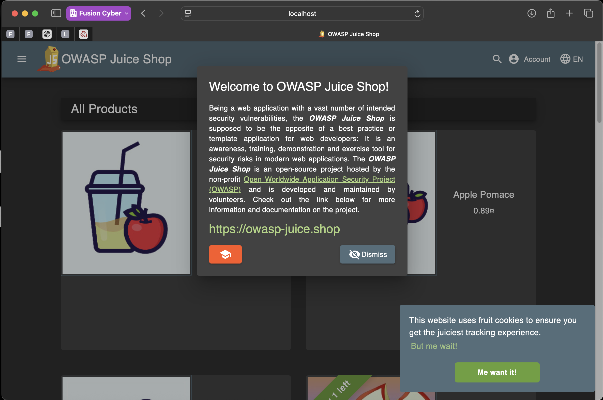
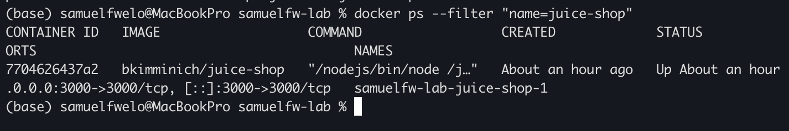
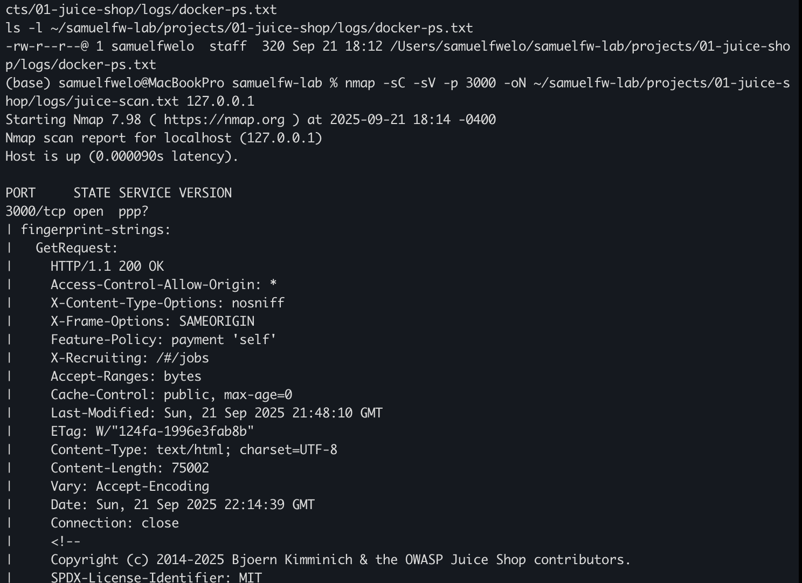
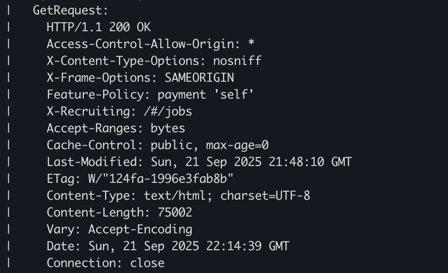

# OWASP Juice Shop Lab

This project demonstrates my ability to deploy, enumerate, and analyze a deliberately vulnerable application (OWASP Juice Shop).

---

## 1. Running Juice Shop
Docker Compose was used to spin up the Juice Shop container.

**Screenshot:**  

---

## 2. Docker Container Verification
Confirmed the container was running successfully.

**Screenshot:**  

[View Docker PS log](logs/docker-ps.txt)

---

## 3. Nmap Scan
Performed service enumeration with Nmap on port 3000.

**Screenshot:**  

[View Full Scan Log](logs/juice-scan.txt)

---

## 4. HTTP Response Headers
Captured server headers using `curl`.

**Screenshot:**  

[View Headers Log](logs/juice-headers.txt)

---

## Key Takeaways
- Learned to deploy vulnerable web apps in isolated environments with Docker.  
- Practiced Nmap enumeration and HTTP header analysis.  
- Documented results with logs + screenshots to build repeatable methodology.
